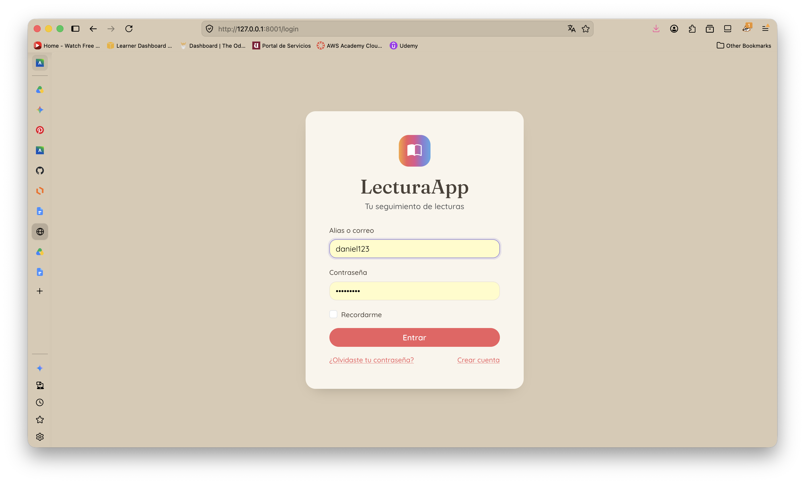
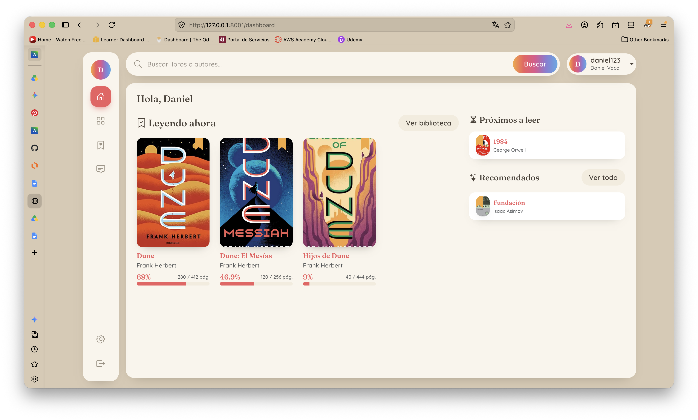
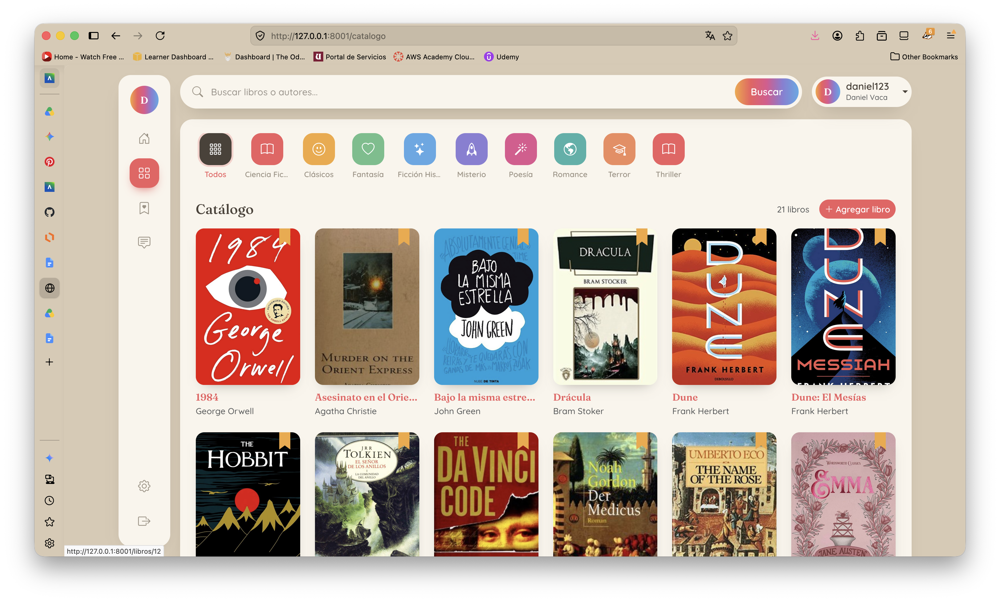
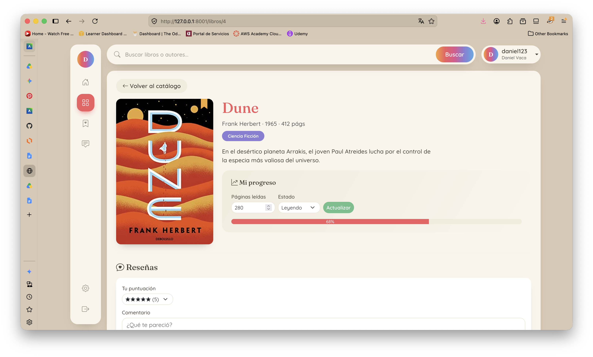
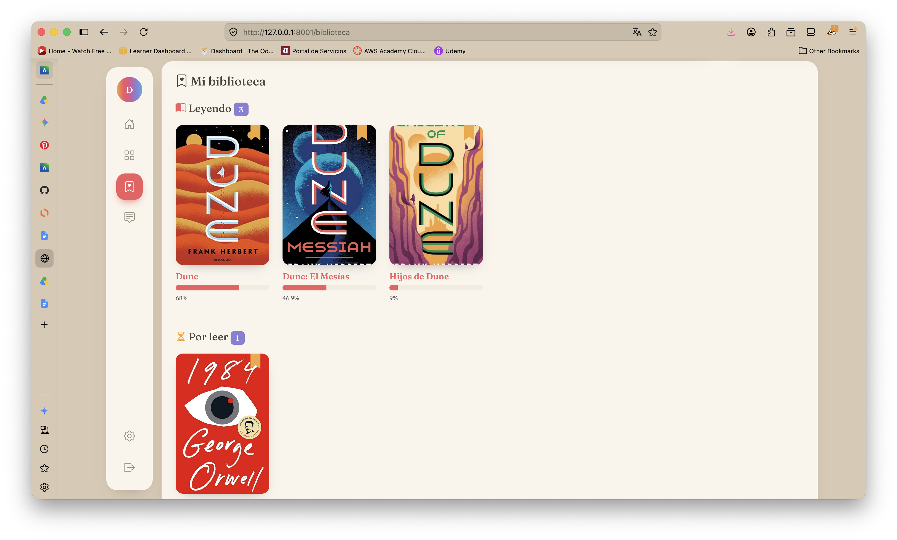
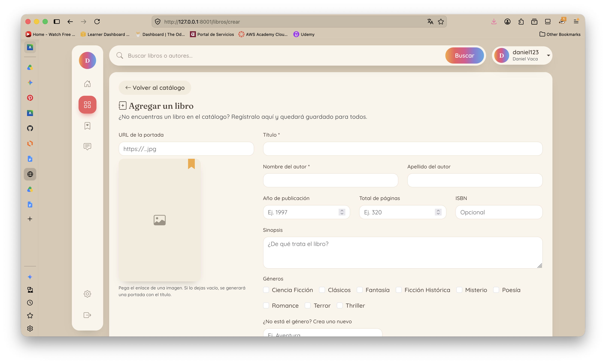
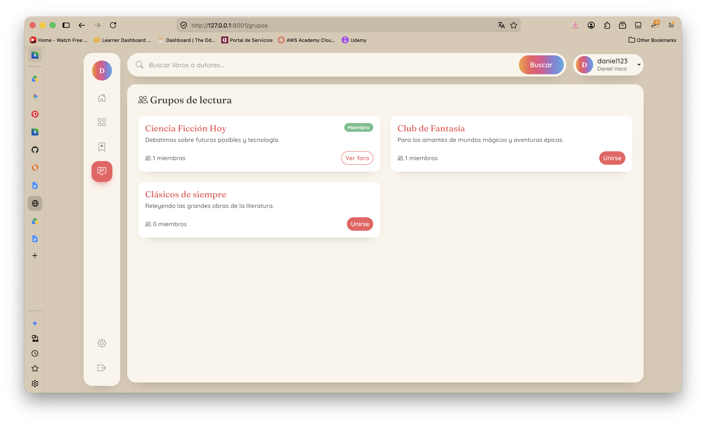
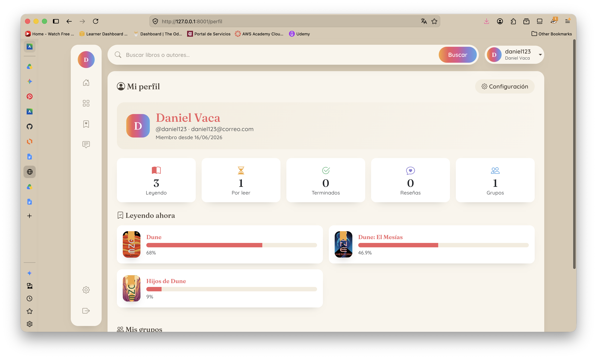
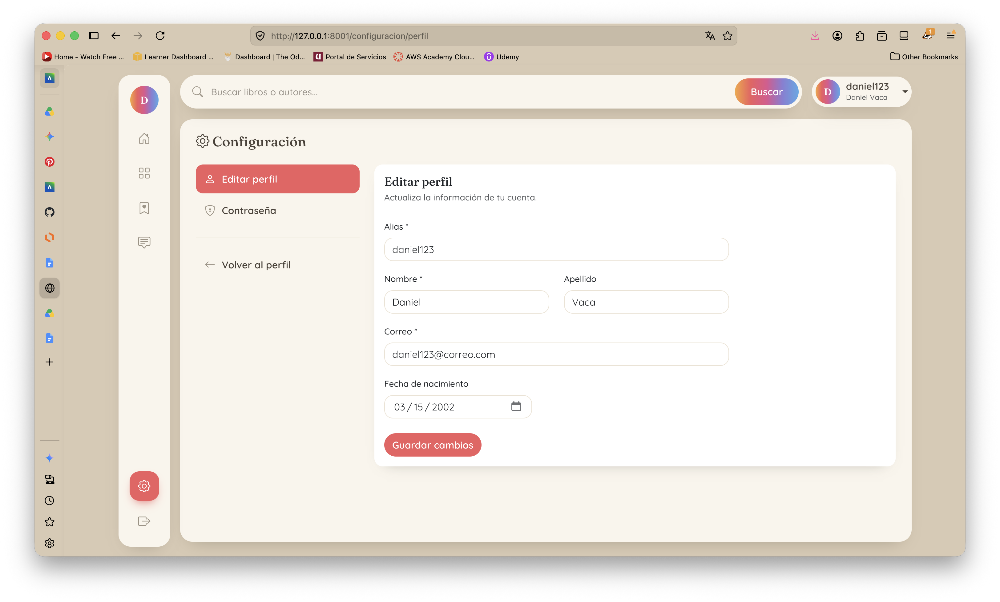

# LecturaApp — Plataforma de seguimiento de lecturas

**Materia:** Lenguajes de Programación | **Periodo:** 2026-1 | **Estado:** Completado

Aplicación web para descubrir libros, organizar una biblioteca personal, llevar el
progreso de lectura y participar en grupos de lectura. Construida con Laravel y
Blade, usa **SQLite** (un solo archivo, sin instalar MySQL) y obtiene las portadas
desde la API de Open Library con un respaldo generado cuando no hay portada.

## Equipo de trabajo

- [Paula Martillo](https://github.com/paumquintana)
- [Daniel Vaca](https://github.com/daniel-vaca13)

## Capturas / Demo

| Inicio de sesión | Dashboard |
|---|---|
|  |  |

| Catálogo | Detalle de libro |
|---|---|
|  |  |

| Mi biblioteca | Agregar libro |
|---|---|
|  |  |

| Grupos de lectura | Mi perfil |
|---|---|
|  |  |

| Configuración |
|---|
|  |

## Funcionalidad

- [x] **Autenticación completa**: registro, inicio de sesión y recuperación de contraseña.
- [x] **Dashboard personalizado**: secciones "Leyendo ahora" (portadas grandes con progreso), "Próximos a leer" y "Recomendados".
- [x] **Catálogo de libros**: búsqueda por título/autor, filtro por género y alta de libros nuevos.
- [x] **Detalle de libro con reseñas**: ficha del libro y publicación de reseñas.
- [x] **Mi biblioteca y progreso**: seguimiento del porcentaje y páginas leídas por lectura.
- [x] **Grupos de lectura**: unirse a grupos, verlos y publicar mensajes.
- [x] **Perfil y configuración**: ver perfil, editar datos y cambiar contraseña.
- [x] **Portadas vía Open Library API**: descarga de portadas reales con respaldo generado.

> Historial completo de cambios: [Commits del repositorio](https://github.com/paumquintana/ProyectoIParcialLenguajesProgramacion/commits)

## Tecnologías

`PHP 8.3` | `Laravel 13` | `Blade` | `Bootstrap 5 (CDN)` | `SQLite` | `Vite` | `Open Library API`

## Ejecución

```bash
# 1. Clonar el repositorio
git clone https://github.com/paumquintana/ProyectoIParcialLenguajesProgramacion.git
cd ProyectoIParcialLenguajesProgramacion

# 2. Instalar dependencias de PHP
composer install

# 3. Crear el archivo .env (ya viene configurado para SQLite)
cp .env.example .env

# 4. Generar la clave de la aplicación
php artisan key:generate

# 5. Crear el archivo de base de datos SQLite (vacío)
#    En Windows (PowerShell): New-Item database/database.sqlite
touch database/database.sqlite

# 6. Crear las tablas y cargar datos de ejemplo (offline, sin internet)
php artisan migrate:fresh --seed

# 7. Levantar el servidor
php artisan serve
```

Luego abre la URL que imprime la terminal (normalmente `http://127.0.0.1:8000`).
El seeder crea un usuario de prueba `test@example.com`; si no recuerdas la
contraseña, puedes registrarte en `/register`.

> Bootstrap se carga por CDN, así que **no** hace falta `npm install` ni `npm run dev`.

## Métricas de Progreso

| Indicador | Valor |
|---|---|
| Commits totales | 14 |
| Ramas | 2 (`main`, `paula-martillo`) |
| Cobertura de pruebas | N/D |
| Última actualización | 2026-06-16 |

## Reflexión y Aprendizajes

- **Habilidades desarrolladas:** desarrollo web con Laravel (rutas, controladores, modelos Eloquent, migraciones y seeders), plantillas Blade reutilizables y diseño de interfaz aplicando principios de HCI.
- **Qué funcionó bien:** usar SQLite simplificó la configuración entre equipos; los partials de Blade (`portada`, `libro-card`) permitieron reutilizar componentes y mantener una interfaz consistente.
- **Qué se podría mejorar:** agregar pruebas automatizadas, paginación en el catálogo y cacheo de las portadas de Open Library para reducir llamadas externas.
- **Conceptos clave aplicados de la materia:** patrón MVC, separación de responsabilidades, manejo de relaciones entre entidades y reutilización de código mediante componentes.
